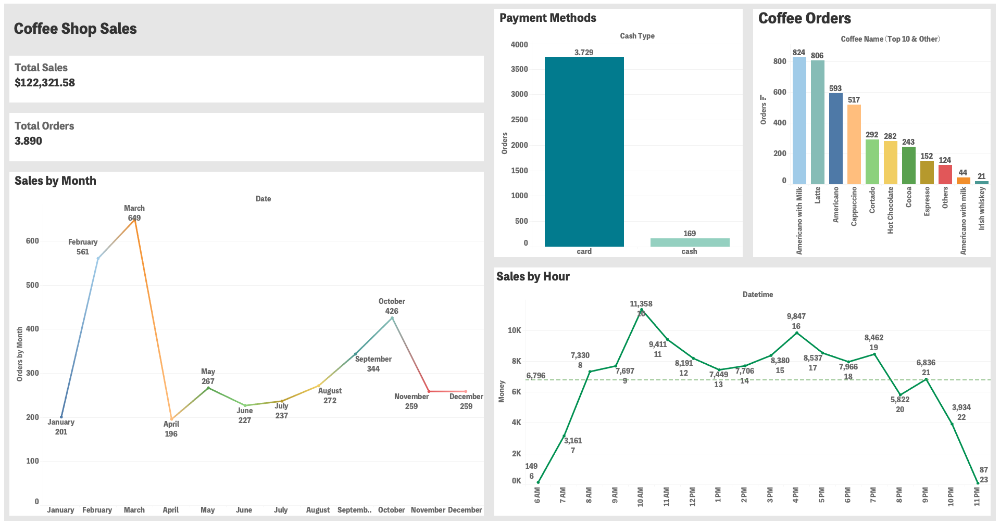

# ☕ Coffee Shop Sales Dashboard

An interactive Tableau dashboard analyzing coffee shop sales data from two vending machines.

## 🎯 Project Goal
The goal of this project was to **understand customer behavior and sales patterns** in a coffee shop environment. By combining data from two vending machines, I identified:
- The most popular coffee types  
- Peak sales hours and months  
- Preferred payment methods  
These insights can help improve stock management, pricing, and marketing strategies.

## 📊 Overview
This project explores and visualizes coffee shop performance metrics using Tableau.  
It highlights:
- 💰 Total sales and total orders  
- 📆 Monthly and hourly sales trends  
- ☕ Customer coffee preferences  
- 💳 Payment method distribution  

## 🧠 What I Learned
During this project, I practiced and learned several Tableau features and data analysis techniques:
- 🔹 **Sets and Groups** to organize coffee types and categories  
- 🧮 **Calculated Fields** to create new metrics and custom KPIs  
- 🔗 **Joins** to combine data from **Vending Machine 1** and **Vending Machine 2**  
- 📈 **Dashboards and Layouts** to design an interactive and visually balanced interface  
- 🎨 **Filters and Parameters** to make the dashboard dynamic and user-friendly  

## 🧩 Tools
- **Tableau Desktop / Tableau Public**
- **Dataset:** Coffee Shop Sales (Vending Machine 1 & 2)

## 📸 Dashboard Preview

## 🚀 How to Open
1. Download the file `coffee_shop_dashboard.twbx`
2. Open it in Tableau Desktop or Tableau Public

<!-- 
## 🌐 Tableau Public Link
🔗 [View Interactive Dashboard on Tableau Public](https://public.tableau.com/)
-->

## 💬 Author
Created by **Renata Silva**  
📅 2025
